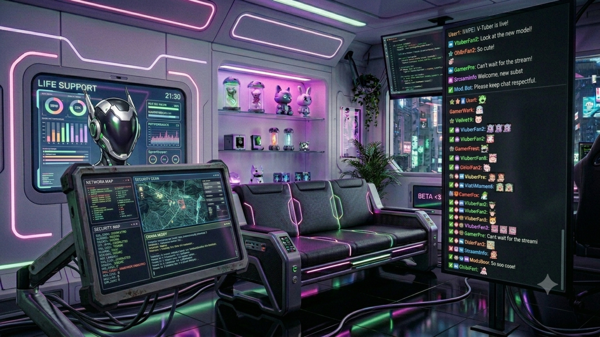
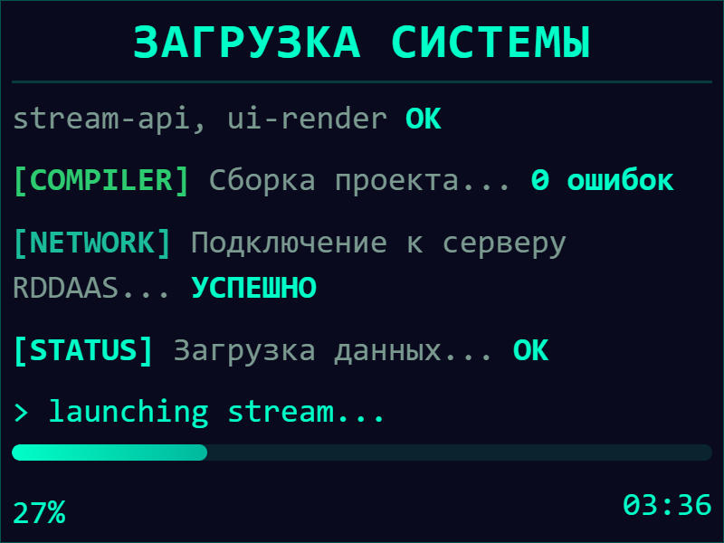
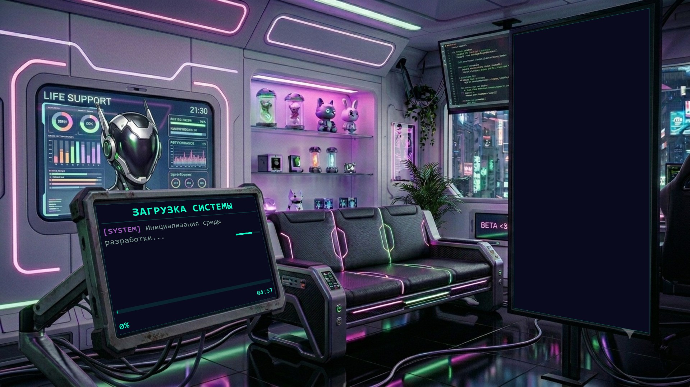

# CSS Matrix3D — Калькулятор перспективы

[English version](README.md)

Браузерный инструмент для генерации CSS-трансформаций `matrix3d()` с перспективной проекцией. Укажите 4 угла на поле и размер виджета — получите готовый CSS-код.

**Ключевые слова:** CSS matrix3d, перспективная трансформация, 3D CSS, гомография, отображение четырёхугольника, генератор CSS-трансформаций, перспективная проекция, CSS 3D-эффекты, фоновое изображение, перспективный макет, инструмент перспективы CSS

## Использование

[Открыть в браузере](https://ku6epxboctuk.is-a.dev/css-matrix-calc/) — не требует сборки.

- **Редактирование** — перетаскивайте углы на SVG-поле, настраивайте размеры поля и виджета
- **Предпросмотр** — результат трансформации matrix3d() обновляется в реальном времени

Скопируйте CSS из раздела «CSS Output» и вставьте в свой проект.

## Пошаговый пример

Размещение виджета на экране в фоновом изображении с помощью перспективной трансформации.

### 1. Загрузите фоновое изображение

Загрузите фотографию фона на поле. Она послужит визуальным ориентиром для позиционирования углов.



### 2. Загрузите изображение виджета

Загрузите виджет (например, панель интерфейса или скриншот), который хотите разместить на экране.



### 3. Сопоставьте углы с целевой областью

Перетащите 4 угла на SVG-поле так, чтобы они совпали с краями экрана (или любой другой четырёхугольной поверхности) на фоновом изображении. Предпросмотр обновляется в реальном времени.

### 4. Получите результат

Виджет отрисовывается с правильной перспективой, соответствующей углу наклона экрана на фоне.



Скопируйте сгенерированный CSS с `matrix3d()` и вставьте в свой проект.

## Возможности

- Чистая математика — расчёт matrix3d() на основе гомографии
- Предпросмотр в реальном времени
- Перетаскивание углов мышью
- Редактируемые размеры поля с блокировкой пропорций
- Масштабирование координат при изменении размера поля
- **Загрузка фонового изображения** — загрузка изображения на поле для визуальной ориентации
- **Загрузка изображения виджета** — загрузка изображения в виджет с автоматическим подбором размера
- Три способа загрузки: выбор файла, вставка через Ctrl+V, drag & drop
- **Настройка object-fit** — contain, cover, fill, none, scale-down
- Нулевые зависимости, работает в любом современном браузере

## Фоновое изображение

Загрузите фоновое изображение на поле, чтобы использовать его как ориентир при позиционировании углов. Полезно для точного совпадения перспективы существующих скриншотов или фотографий.

**Как загрузить:**

- Нажмите «Загрузить изображение» и выберите файл
- Нажмите Ctrl+V, чтобы вставить из буфера обмена
- Перетащите файл изображения на левую колонку или панель «Фон»

**Настройка отображения:**

- Используйте выпадающий список object-fit для управления масштабированием изображения: contain, cover, fill, none или scale-down

## Изображение виджета

Загрузите изображение непосредственно в виджет. При загрузке изображения размеры виджета (Ш/В) автоматически подстраиваются под размер изображения и блокируются.

**Как загрузить:**

- Нажмите «Загрузить изображение» на панели виджета
- Нажмите на поле вставки и нажмите Ctrl+V
- Перетащите файл изображения на панель виджета

**Удаление:**

- Нажмите «Удалить», чтобы очистить изображение виджета и разблокировать размеры

## Применение

- **Презентации и лендинги** — отрисовка виджета или скриншота на мониторе под любым углом
- **Карусели и галереи** — демонстрация карточек товаров с перспективной деформацией
- **Интерактивные инфографики** — наложение данных на карты или диаграммы с перспективой
- **Превью приложений** — размещение мобильного интерфейса на фоне устройства
- **Эффекты при скролле** — анимация matrix3d для 3D-эффектов без WebGL
- **Макеты и прототипы** — визуальное размещение интерфейсов в контексте (на стене, ноутбуке, баннере)
- **Совпадение перспективы** — загрузите фото экрана, совместите углы, получите точную CSS-трансформацию

## Структура проекта

```text
├── index.html
├── style.css
└── js/
    ├── main.js          — точка входа
    ├── state.js         — управление состоянием
    ├── homography.js    — математика гомографии
    ├── svg-renderer.js  — SVG-рендеринг
    ├── drag.js          — обработка перетаскивания
    ├── inputs.js        — поля ввода
    ├── preview.js       — предпросмотр
    └── ui.js            — кнопки, режимы, загрузка изображений
```

## Как это работает

Инструмент использует [гомографию](<https://en.wikipedia.org/wiki/Homography_(computer_vision)>) для вычисления 3D-перспективной трансформации по 4 соответствующим точкам. Результирующее CSS-свойство `matrix3d()` отображает прямоугольный виджет на произвольный четырёхугольник, заданный пользователем.

## Лицензия

MIT
